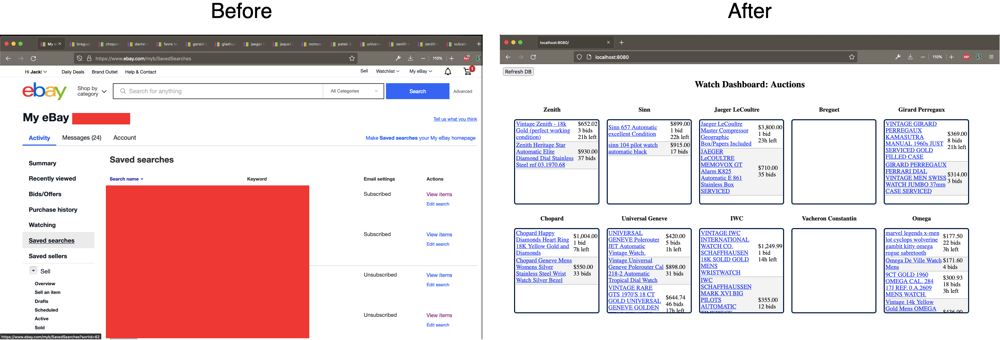
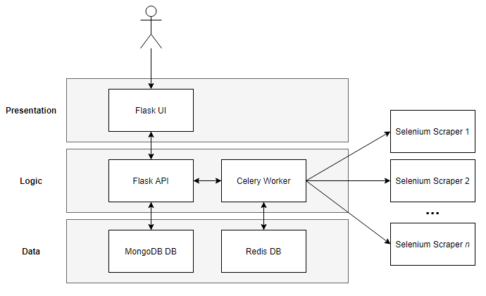

## Summary
This app scrapes and aggregates recently ending eBay auctions from a list of search terms onto a unified dashboard. This dashboard prevents the need to open saved auctions as many separate tabs in a browser. The app also utilizes scalable Selenium web scraping to prevent the need for eBay Developer Account API access.

## **Built With**

 - [Flask](https://github.com/pallets/flask) for web framework 
 - [Selenium](https://github.com/SeleniumHQ/selenium) for scraping eBay UI
 - [Celery](https://github.com/celery/celery) for scaling asynchronous scrapers
 - [Redis](https://github.com/redis/redis) for Celery backend
 - [Flower](https://github.com/mher/flower) for monitoring Celery workers
 - [MongoDB](https://github.com/mongodb/mongo) for storing auction results
 - [Docker Compose](https://github.com/docker/compose) for managing multiple containers

## Architecture

## Prerequisites

This app requires an existing Docker and Docker Compose installation.

## **Running Application**

    docker-compose up --scale celery_worker=n

The number of Celery workers to use depends on machine hardware capabilities. I recommend starting with `3` and adjusting per performance.

- Main Dashboard: [localhost:8080](localhost:8080)
- Flower UI: [localhost:5555](localhost:5555)

To refresh the dashboard, click the **Refresh DB** button and wait 1-2 minutes.

## Modifying Search Terms

 - Navigate to `src/api/search_templates` 
 - Open `watch_list.csv` in Excel or equivalent 
 - Add and remove search terms as necessary

## Future Development

 - Support for Buy-It-Now listings is under active development  
 - The experimental Buy-It-Now page is currently located at [localhost:8080/bit](localhost:8080/bit)

